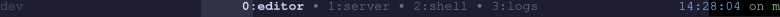
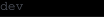
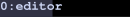
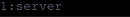
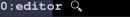
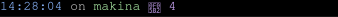

# tmuxship

[](https://crates.io/crates/tmuxship)
[](https://opensource.org/licenses/MIT)

A thin [Starship](https://starship.rs) adapter for tmux that renders beautiful, customizable status bars.

Use the full power of Starship to style your tmux status bar, with automatic access to tmux session, window, pane, and client information as environment variables.



## Features

- **Built-in Theme Suite & Live Preview** — Browse, preview, and activate legendary themes (Rosé Pine, Catppuccin, Tokyo Night, Nord, Gruvbox, Dracula, Kanagawa, and more) with zero configuration.
- **Full Starship compatibility** — Use any Starship module, prompt, or custom styling in your tmux status bar.
- **Rich tmux context** — Session, window, pane, and client variables are automatically injected as `TMUX_*` environment variables.
- **Per-side configuration** — Separate Starship configs for `status-left`, `status-right`, and `window-status` (center).
- **Prefix highlighting** — Style your status bar differently when the tmux prefix key is active.
- **Zero boilerplate** — No wrapper scripts or complex tmux format strings required.

## Prerequisites

- [tmux](https://github.com/tmux/tmux) 3.0+
- [Starship](https://starship.rs) installed on your system
- [Rust](https://www.rust-lang.org/tools/install) (if installing from source or crates.io)

## Quick Start

### 1. Install

```bash
cargo install tmuxship
```

### 2. Choose a Theme

Preview all built-in themes in your terminal with live ANSI mockups:

```bash
tmuxship theme preview
```

Or preview a specific theme like Rosé Pine or Catppuccin:

```bash
tmuxship theme preview rose-pine
tmuxship theme preview catppuccin-mocha
```

### 3. Activate in tmux

Add to `~/.tmux.conf`:

```tmux
setenv -g TMUX_SHIP_THEME "rose-pine"

run-shell 'tmuxship apply'
```

*Or if you want to use custom config files:*

```tmux
setenv -g TMUX_SHIP_LEFT_CONFIG   "$HOME/.tmux/starship.toml"
setenv -g TMUX_SHIP_RIGHT_CONFIG  "$HOME/.tmux/.right.toml"
setenv -g TMUX_SHIP_CENTER_CONFIG "$HOME/.tmux/.center.toml"

run-shell 'tmuxship apply'
```

### 4. Reload

```bash
tmux source ~/.tmux.conf
```

---

## Built-in Themes

tmuxship includes built-in presets for legendary terminal themes:

| Theme ID | Name | Variant | Inspiration / Origin |
|---|---|---|---|
| `rose-pine` | Rosé Pine | Dark | [rose-pine/tmux](https://github.com/rose-pine/tmux) |
| `rose-pine-moon` | Rosé Pine Moon | Dark | [rose-pine/tmux](https://github.com/rose-pine/tmux) |
| `rose-pine-dawn` | Rosé Pine Dawn | Light | [rose-pine/tmux](https://github.com/rose-pine/tmux) |
| `catppuccin-mocha` | Catppuccin Mocha | Dark | [catppuccin/tmux](https://github.com/catppuccin/tmux) |
| `catppuccin-macchiato` | Catppuccin Macchiato | Dark | [catppuccin/tmux](https://github.com/catppuccin/tmux) |
| `catppuccin-frappe` | Catppuccin Frappé | Dark | [catppuccin/tmux](https://github.com/catppuccin/tmux) |
| `catppuccin-latte` | Catppuccin Latte | Light | [catppuccin/tmux](https://github.com/catppuccin/tmux) |
| `tokyo-night` | Tokyo Night | Dark | Tokyo Night |
| `tokyo-night-moon` | Tokyo Night Moon | Dark | Tokyo Night Moon |
| `nord` | Nord | Dark | Arctic Ice Studio Nord |
| `gruvbox-dark` | Gruvbox Dark | Dark | morhetz Gruvbox |
| `gruvbox-light` | Gruvbox Light | Light | morhetz Gruvbox |
| `dracula` | Dracula | Dark | Zeno Rocha Dracula |
| `kanagawa` | Kanagawa | Dark | rebelot Kanagawa Wave |
| `onedark` | One Dark | Dark | Atom One Dark |
| `solarized-dark` | Solarized Dark | Dark | Ethan Schoonover Solarized |
| `solarized-light` | Solarized Light | Light | Ethan Schoonover Solarized |

### Theme CLI Commands

```bash
# List all available themes
tmuxship theme list
tmuxship theme list --json

# Preview themes with realistic terminal mockups
tmuxship theme preview
tmuxship theme preview rose-pine
tmuxship theme preview --filter light

# Show Starship TOML configuration for a theme
tmuxship theme show rose-pine --side left
tmuxship theme show catppuccin-mocha --side all

# Export theme configs to a directory
tmuxship theme export rose-pine --dir ./my-theme

# Install theme directly to ~/.tmux/
tmuxship theme install rose-pine

# Print tmux.conf snippet for quick activation
tmuxship theme init rose-pine
```

---

## How It Works

The recommended way to use tmuxship is `tmuxship apply`, which runs once at startup and converts your Starship TOML styles into native tmux `status-left`, `status-right`, and `window-status` options. This is fast, flicker-free, and requires no background processes.

For segments that need live data (battery, git status, frequently updating clocks), you can fall back to **runtime rendering** with `#(tmuxship <side>)`. This runs every `status-interval`, injects `TMUX_*` env vars, calls Starship, and converts ANSI colors to tmux format strings.

| Mode | When to use |
|---|---|
| **`tmuxship apply`** (preferred) | Colors, session name, window list, host — anything that changes on tmux events | 
| **`#(tmuxship <side>)`** | Live data that changes outside of tmux (battery, git status, external APIs) |

You can mix both modes: use `tmuxship apply` for the frame, and override a single side with runtime rendering when needed.

### Available Commands

| Command | Description |
|---|---|
| `tmuxship left` | Render the left status segment (supports `--theme <id>` and `--config <path>`) |
| `tmuxship right` | Render the right status segment (supports `--theme <id>` and `--config <path>`) |
| `tmuxship center` | Render the window status segment (supports `--theme <id>` and `--config <path>`) |
| `tmuxship full` | Render all segments |
| `tmuxship emit-tmux-conf` | Print the generated tmux config (dry-run, supports `--theme <id>`) |
| `tmuxship apply` | Apply the generated config to the running tmux server (supports `--theme <id>`) |
| `tmuxship theme list` | List all built-in themes (supports `--json` and `--filter`) |
| `tmuxship theme preview` | Preview themes with colored terminal status bar mockups |
| `tmuxship theme show` | Print Starship TOML configuration for a theme |
| `tmuxship theme export` | Export a theme's config files to a folder |
| `tmuxship theme install` | Install theme files to `~/.tmux/` |
| `tmuxship theme init` | Print ready-to-use `~/.tmux.conf` snippet for a theme |

---

## Configuration

### Config File Resolution

tmuxship resolves Starship config files for each side (`left`, `right`, `center`) in the following order:

1. `--config` flag
2. `TMUX_SHIP_<SIDE>_CONFIG` environment variable (e.g. `TMUX_SHIP_LEFT_CONFIG`)
3. `STARSHIP_CONFIG`
4. `--theme` flag or `TMUX_SHIP_THEME` environment variable (built-in theme preset)
5. `$XDG_CONFIG_HOME/tmux/.<side>.toml`
6. `$XDG_CONFIG_HOME/tmux/starship.toml`
7. `$XDG_CONFIG_HOME/starship/.<side>.toml`
8. `$XDG_CONFIG_HOME/starship/starship.toml`
9. `$HOME/.config/tmux/.<side>.toml`
10. `$HOME/.config/tmux/starship.toml`
11. `$HOME/.tmux/.<side>.toml`
12. `$HOME/.tmux/starship.toml`
13. `$HOME/.config/starship/.<side>.toml`
14. `$HOME/.config/starship/starship.toml`

### Complete tmux.conf Example

```tmux
set -g status on
set -g status-left-length 100
set -g status-right-length 200
set -g status-justify centre
set -g focus-events on

# Config paths for each status segment
setenv -g TMUX_SHIP_LEFT_CONFIG   "$HOME/.tmux/starship.toml"
setenv -g TMUX_SHIP_RIGHT_CONFIG  "$HOME/.tmux/.right.toml"
setenv -g TMUX_SHIP_CENTER_CONFIG "$HOME/.tmux/.center.toml"
setenv -g TMUX_SHIP_WINDOW_SEPARATOR " • "

# Generate status-left, status-right, and window-status options from Starship configs.
# Styles come from Starship TOML; tmux-native format strings (#S, #I, #W) render the values.
run-shell 'tmuxship apply'

# Refresh the status bar on relevant tmux events
set-hook -g client-session-changed 'refresh-client -S'
set-hook -g client-attached        'refresh-client -S'
set-hook -g pane-focus-in          'refresh-client -S'

set -g window-status-style "bg=default,fg=default"

# Default refresh interval (1 minute is plenty for static styling)
set -g status-interval 60
```

**Key points:**

- Config paths are set once with `setenv -g` and picked up automatically by tmuxship.
- `tmuxship apply` generates tmux options from Starship custom module styles, keeping color definitions in TOML.
- Runtime `#(tmuxship right)` still injects `TMUX_*` environment variables for shell-driven modules.
- Keep `tmuxship` on your `PATH`, or use an absolute path in your tmux config.

#### Optional: Extra Hooks for Focus Events

Some terminals or older tmux versions skip certain hooks. If your status bar feels stale on focus changes, uncomment these:

```tmux
# Refresh on focus transitions
# bind-key -n FocusIn  refresh-client -S
# bind-key -n FocusOut refresh-client -S

# Additional hooks (uncomment if needed)
# set-hook -g client-focus-in        'refresh-client -S'
# set-hook -g client-focus-out       'refresh-client -S'
# set-hook -g after-select-window    'refresh-client -S'
# set-hook -g after-new-window       'refresh-client -S'
# set-hook -g window-pane-changed    'refresh-client -S'
# set-hook -g window-layout-changed  'refresh-client -S'
```

### Runtime Rendering (Escape Hatch)

If you need live data that `tmuxship apply` cannot capture (battery, git status, etc.), override a specific side with runtime rendering:

```tmux
set -g status-right '#(tmuxship right)'
set -g window-status-format         '#(TMUX_SHIP_TARGET="#{window_id}" tmuxship center)'
set -g window-status-current-format '#(TMUX_SHIP_TARGET="#{window_id}" tmuxship center)'
```

Set `TMUX_SHIP_TARGET` to a tmux format string like `#{window_id}` so tmuxship queries data for the correct window rather than the active one.

To inspect what `tmuxship apply` would generate before applying:

```bash
tmuxship emit-tmux-conf
```

**Recognized custom module names for generated config:**

- `prefix_active` and `session_normal` (left config) → generates `status-left` around tmux-native `#S`
- `window_active`, `window_inactive`, `window_zoom` (center config) → generates window status around `#I`, `#W`, and `#{window_zoomed_flag}`; separator text is controlled by `TMUX_SHIP_WINDOW_SEPARATOR`
- Right config is always runtime-rendered as `#(tmuxship right)`

---

## Examples

### Full status bar


*Left: session name · Center: window list (active highlighted) · Right: time, host, window count*

### Left status — session with prefix highlighting

| Normal | Prefix active |
|---|---|
|  |  |

The session name is subtle in normal state and gets a bright green background when you press the tmux prefix key.

`starship.toml` (set via `TMUX_SHIP_LEFT_CONFIG`):

```toml
"$schema" = 'https://starship.rs/config-schema.json'
format = "$custom"
add_newline = false

# Shown when the prefix key is active
[custom.prefix_active]
when = 'test "${TMUX_CLIENT_PREFIX:-0}" = "1"'
command = 'printf "%s" "${TMUX_SESSION_NAME}"'
format = "[$output]($style) "
style = "bg:#95E6CB bold"

# Shown in normal state
[custom.session_normal]
when = 'test "${TMUX_CLIENT_PREFIX:-0}" != "1"'
command = 'printf "%s" "${TMUX_SESSION_NAME}"'
format = "[$output]($style) "
style = "fg:#565B66"
```

### Center — window list with active/inactive styling

| Active | Inactive | Zoomed |
|---|---|---|
|  |  |  |

Active windows get a bold, highlighted style. Inactive windows are muted. Zoomed windows show an indicator.

`.center.toml` (set via `TMUX_SHIP_CENTER_CONFIG`):

```toml
format = "$custom"
add_newline = false

[custom.window_active]
when = 'test "${TMUX_WINDOW_ACTIVE:-0}" = "1"'
command = 'printf "%s:%s" "${TMUX_WINDOW_INDEX}" "${TMUX_WINDOW_NAME}"'
format = "[$output]($style)"
style = "bg:#313244 fg:#CDD6F4 bold"

[custom.window_inactive]
when = 'test "${TMUX_WINDOW_ACTIVE:-0}" != "1"'
command = 'printf "%s:%s" "${TMUX_WINDOW_INDEX}" "${TMUX_WINDOW_NAME}"'
format = "[$output]($style)"
style = "fg:#6C7086"

# Optional: show an icon when the active window is zoomed
[custom.window_zoom]
when = 'test "${TMUX_WINDOW_ACTIVE:-0}" = "1" && test "${TMUX_WINDOW_ZOOMED_FLAG:-0}" = "1"'
command = 'printf "🔍"'
format = " $output"
```

### Right — time, host, and window count



`.right.toml` (set via `TMUX_SHIP_RIGHT_CONFIG`):

```toml
"$schema" = 'https://starship.rs/config-schema.json'

format = "$time$custom"
add_newline = false

[time]
disabled = false
format = "[$time]($style) "
style = "fg:#89B4FA"
time_format = "%H:%M:%S"

[custom.host]
when = "true"
shell = "bash"
command = 'printf "%s" "${TMUX_HOST_SHORT:-$(hostname -s)}"'
format = "on [$output]($style) "
style = "fg:#A6E3A1"

[custom.window_count]
when = "true"
shell = "bash"
command = 'printf "%s" "${TMUX_SESSION_WINDOWS}"'
format = "[󰖲 $output]($style)"
style = "fg:#CBA6F7"
```

### Advanced left — session, git branch, and directory


Combine built-in Starship modules with custom tmux-aware modules for a rich left status.

`advanced-left.toml`:

```toml
"$schema" = 'https://starship.rs/config-schema.json'

format = "$custom$directory$git_branch$git_status"
add_newline = false

# Session name with prefix highlighting
[custom.session_prefix]
shell = "bash"
when = 'test "${TMUX_CLIENT_PREFIX:-0}" = "1"'
command = 'printf "󰇄 %s" "${TMUX_SESSION_NAME:-?}"'
format = "[$output]($style) "
style = "bg:#95E6CB fg:#1E1E2E bold"

[custom.session_normal]
shell = "bash"
when = 'test "${TMUX_CLIENT_PREFIX:-0}" != "1"'
command = 'printf "󰇄 %s" "${TMUX_SESSION_NAME:-?}"'
format = "[$output]($style) "
style = "fg:#565B66"

# Current directory (from the active pane's CWD)
[directory]
format = "[$path]($style) "
style = "fg:#89B4FA"
truncation_length = 3
truncate_to_repo = true

# Git branch
[git_branch]
format = "on [$symbol$branch]($style) "
symbol = ""
style = "fg:#A6E3A1"

# Git status indicators
[git_status]
format = '([\[$all_status$ahead_behind\]]($style) )'
style = "fg:#F9E2AF"
```

See the [examples/](examples/) directory for all available configuration samples.

---

## Available tmux Variables

All tmux variables are automatically injected into the Starship environment with a `TMUX_` prefix.

### Session

| Variable | Description |
|---|---|
| `TMUX_SESSION_NAME` | Current session name |
| `TMUX_SESSION_ID` | Session ID |
| `TMUX_SESSION_CREATED` | Session creation timestamp |
| `TMUX_SESSION_ATTACHED` | Number of attached clients |
| `TMUX_SESSION_WINDOWS` | Number of windows |

### Window

| Variable | Description |
|---|---|
| `TMUX_WINDOW_ID` | Window ID |
| `TMUX_WINDOW_INDEX` | Window index |
| `TMUX_WINDOW_NAME` | Window name |
| `TMUX_WINDOW_ACTIVE` | `1` if active, `0` otherwise |
| `TMUX_WINDOW_FLAGS` | Window flags |
| `TMUX_WINDOW_LAYOUT` | Window layout |
| `TMUX_WINDOW_PANES` | Number of panes |
| `TMUX_WINDOW_WIDTH` / `TMUX_WINDOW_HEIGHT` | Window dimensions |
| `TMUX_WINDOW_ZOOMED_FLAG` | `1` if zoomed, `0` otherwise |

### Pane

| Variable | Description |
|---|---|
| `TMUX_PANE_ID` | Pane ID |
| `TMUX_PANE_INDEX` | Pane index |
| `TMUX_PANE_TITLE` | Pane title |
| `TMUX_PANE_CURRENT_PATH` | Current working directory |
| `TMUX_PANE_CURRENT_COMMAND` | Running command |
| `TMUX_PANE_PID` | Process ID |
| `TMUX_PANE_WIDTH` / `TMUX_PANE_HEIGHT` | Pane dimensions |
| `TMUX_PANE_ACTIVE` | `1` if active, `0` otherwise |
| `TMUX_PANE_AT_TOP` / `TMUX_PANE_AT_BOTTOM` / `TMUX_PANE_AT_LEFT` / `TMUX_PANE_AT_RIGHT` | Edge position flags |

### Client

| Variable | Description |
|---|---|
| `TMUX_CLIENT_PREFIX` | `1` if prefix key is active, `0` otherwise |
| `TMUX_CLIENT_WIDTH` / `TMUX_CLIENT_HEIGHT` | Terminal dimensions |
| `TMUX_CLIENT_TERMNAME` | Terminal name |

### Host

| Variable | Description |
|---|---|
| `TMUX_HOST` | Full hostname |
| `TMUX_HOST_SHORT` | Short hostname |

---

## Advanced

### Limiting Fetched Variables

By default, tmuxship fetches all common tmux variables. To reduce overhead, specify only the variables you need:

```tmux
set -g status-left '#(TMUX_SHIP_TMUX_VARS="session_name,window_index" tmuxship left)'
```

### Rendering Pipeline

1. tmux invokes tmuxship via `#(tmuxship left)` (or another side).
2. tmuxship queries tmux and exposes variables as `TMUX_*` environment variables.
3. Starship is executed with the resolved config file.
4. ANSI color codes from Starship output are converted to tmux format strings.
5. The result is written to stdout for tmux to render.

---

## Contributing

Contributions are welcome. Please see [CONTRIBUTING.md](CONTRIBUTING.md) for details.

### Development

```bash
cargo test
```

#### Generating Screenshots

Screenshots are generated from Starship ANSI output using [ansisvg](https://github.com/wader/ansisvg):

```bash
# Install ansisvg (requires Go)
go install github.com/wader/ansisvg@latest

# Generate screenshots from example configs
./scripts/generate-screenshots.sh
```

Output SVGs are placed in `screenshots/`.

## License

MIT
